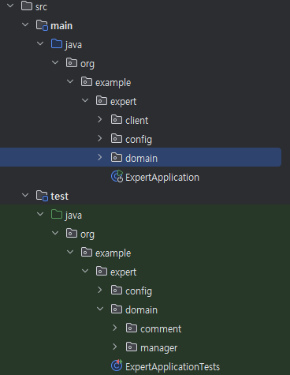

# SPRING 리팩토링

# 🎩 KioskProject

🪄 **키오스크 프로젝트**

## 🖥️ 개발 프로세스(환경)

### ⛏️IDE :
- `Intellij`

### 📌 Java :
- **JDK 17버전 사용**

### 📌 Springboot :
- **Springboot 3.3.3 사용**

### 🔁 Version Control :
- `Git`

## ✅ 요구사항

### LV1️⃣ 코드개선

- **Early Return**

  - **조건에 맞지 않은 경우 즉시 리턴하여 불필요한 로직을 실행 방지하고 성능 향상**

  - **`AuthService` 클래스에서 `signup` 메서드 리팩토링**

- **리팩토링 퀴즈**

  - **불필요한 if-else 피하기**

  - **복잡한 `if-else` 구조는 코드의 가독성을 떨어트리고 유지보수를 어렵게 만듬**

  - **`WeatherClient` 클래스에서 `getTodayWeather()` 메서드 리팩토링**

- **코드 개선 퀴즈**

  - **`UserService` 클래스에서 `changePassword()` 메서드 리팩토링**

  - **Validation → 요청 DTO에서 처리 할 수 있도록 수정**

### LV2️⃣  N+1 문제

- **`N+1` 문제**

  - **`TodoRepository`에서 JPQL `fetch join`을 `@EntityGraph` 기반 구현으로 수정**

    - **`TodoController` `TodoService` 통해  `Todo` 관련 데이터 처리**

### LV3️⃣ 테스트 코드 연습

- **예상대로 성공하는지**

  - **`test` 패키지 안에서 `PassEncoderTest` 클래스에 `matches_메서드가_정상적으로_동작한다()`가 성공하도록 수정**

- **예상대로 예외처리를 하는지**

  - **`test` 패키지 안에서 `ManagerServiceTest` 클래스에 `manager_목록_조회_시_Todo가_없다면_NPE_에러를_던진다()`가 성공하도록 테스트코드와 메서드명 수정**

  - **`test` 패키지 안에서 `CommentServiceTest` 클래스에 `comment_등록_중_할일을_찾지_못해_에러가_발생한다()`가 테스트코드 성공하도록 수정**

  - **`test` 패키지 안에서 `ManagerServiceTest` 클래스에 `todo의_user가_null인_경우_예외가_발생한다()`가 서비스코드 성공하도록 수정**

### LV4️⃣ API 로깅

- **`Interceptor` 또는 `AOP`를 활용한 API 로깅**

  - **어드민 사용자만 접근 할 수 있는 특정 API에 접근할 때마다 접근 로그 기록**

- **어드민 사용자만 접근 가능한 컨트룰러 메서드**

  - **`CommentAdminController` 컨트룰러에 `deleteComment()` 메서드**
  
  - **`UserAdminController` 컨트룰러에 `changeUserRole()` 메서드**

- **로깅 구현 방법**

  - **Interceptor**

    - **요청정보(HttpServletRequest) 사전 처리**

    - **어드민 권한여부 확인하여 인증되지 않은 사용자 접근 차단**

    - **인증 성공 시 , 요청 시각과 URL 로깅**

    - **인증 여부 확인, 인증 되지 않은 경우 예외처리**

  - **AOP**

    - **어드민 API 메서드 실행 전/후 요청/응답 데이터 로깅**
    
    - **로깅 내용**

      - **요청 ID, 시각, URL**

      - **요청/응답 본문**  

      - **`@Around` 어노테이션 사용, `Logger` 클래스를 활용하여 로깅 기록**

## ⭐ 주요 기능

- **코드 리팩토링**

- **N+1 같은 성능 문제 경험**

- **테스트 코드에서 발생하는 문제 경험**

- **공통 기능 로직 처리 (Interceptor, AOP)**

## 📀 디렉토리 구조

## 💫 트러블 슈팅

- **[벨로그](https://velog.io/@dkzh506/Springboot-%EB%A6%AC%ED%8C%A9%ED%86%A0%EB%A7%81)에서 확인**